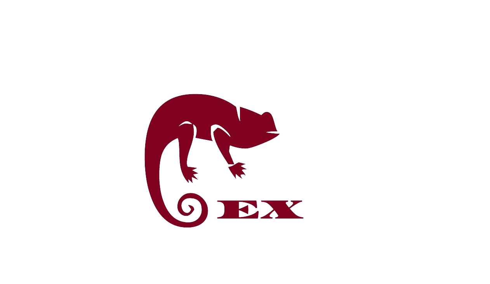

<h1 align="center">
    
Extodan

    
    

      
    

</h1>

Extodan is a cutting-edge and innovative programming language, thoughtfully designed by Garret Tomlin, to combine the finest aspects of various programming paradigms. With the expressive syntax of Elixir, memory safety, garbage collection, and structural typing, Extodan empowers developers to create powerful and efficient applications with ease.

